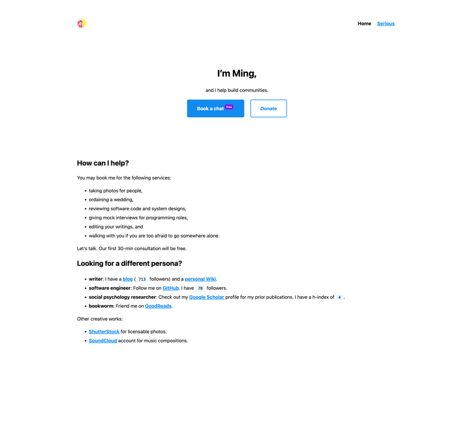

# Ming's personal website

[](https://percy.io/dd9e34b0/myli.page)
[](https://results.pre-commit.ci/latest/github/tslmy/tslmy.github.io/main)
[](https://github.com/psf/black)



To update this screenshot, run `screenshot.py`.

# Build
This website is built with [Cloudflare Pages](https://dash.cloudflare.com/f7bf12f8dd6ca641990492fd26a0a79e/pages/view/homepage) and deployed to [myli.page](https://myli.page), registered via [Google Domains](https://domains.google.com/registrar/myli.page). In this section, let me explain how to build this website locally.

## The Metrics Scraper
`scrape.py` scrapes several websites for some personal metrics. It saves the data to `_data/metrics.yaml`. The metrics are referenced in the index page (`index.md`).

This script is not automatically triggered, since it's a scraper by nature, and it would not be nice to scrape the internet upon every push.

To run `scrape.py`, please use an virtual environment. Assuming you have [`mambaforge`](https://github.com/conda-forge/miniforge#mambaforge) installed, do:

```shell
mamba create -n page python=3 -y
conda activate page
pip install -r requirements.txt
```

## The Website Itself
The Website is statically generated with [Jekyll](https://jekyllrb.com/). To serve it locally, run:

```shell
bundle exec jekyll serve
```

## Contributing
This repo uses [pre-commit hooks](https://pre-commit.com/) to automate many checks upon making a git commit. (See `.pre-commit-config.yaml` for a list of all hooks enabled.) Assuming you have [Homebrew](https://brew.sh/) installed, you can install the `pre-commit` program via:


```shell
brew install pre-commit
```

Then, install the pre-commit hooks via:

```shell
pre-commit install
```
